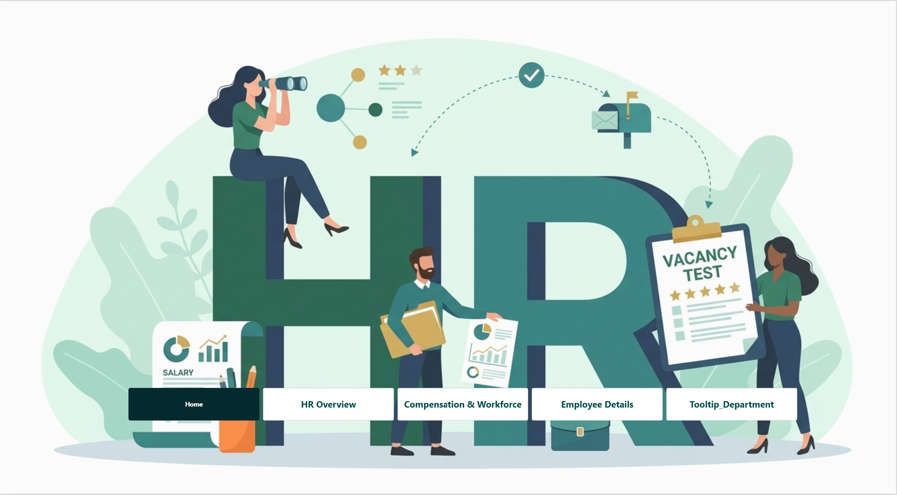
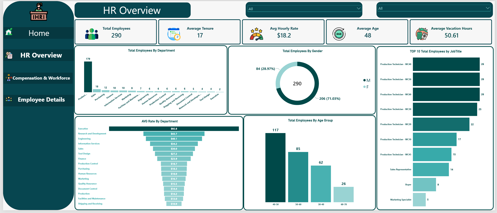
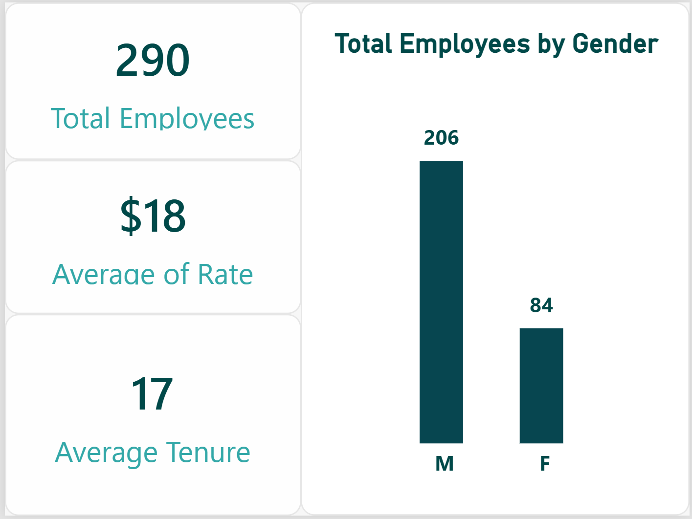

# Enterprise HR Analytics Dashboard 🏢📊

An end-to-end Enterprise HR Analytics project built using **SQL Server** for database structuring and **Power BI** for interactive workforce and compensation visualization[cite: 3]. This dashboard provides deep, data-driven insights into employee demographics, compensation structures, tenure metrics, and departmental performance.

---

## 🚀 Project Overview

The primary objective of this project is to transform raw human resources data into clean, intuitive, and actionable business insights. The solution tracks headcount trends, salary distributions across departments, sick leave metrics, and individual employee profiles using modern business intelligence standards.

---

## 🛠️ Tools & Technologies Used

* **SQL Server / SSMS:** Data preparation, cleaning, structuring, and relational database management[cite: 3].
* **Power BI:** Interactive dashboard design, complex DAX measures, data modeling, and custom tooltip integrations[cite: 3].
* **Star Schema Architecture:** Optimized relational data modeling joining fact tables with dimension tables for high performance[cite: 3].

---

## 📂 Data Model & Architecture (Star Schema)

The data model follows a robust **Star Schema** design to ensure optimal query performance, clean relationships, and accurate cross-filtering:

* **Fact Tables:** `Fact_Employee`, `Fact_PayHistory`[cite: 4]
* **Dimension Tables:** `Dim_Department`, `Dim_Shift`, `Dim_Date`[cite: 4]
* **Measures Table:** Centralized `Dax_Measure` table containing all core business logic, including Average Tenure, Hourly Rates, Salary Growth %, and Total Employees[cite: 4].

---

## 🖥️ Dashboard Pages & Features

### 1. Home Page
A clean, professional landing interface designed with smooth navigation buttons and project branding.

### 2. HR Overview
A high-level overview displaying key workforce metrics including total employees (290), gender distribution, age groups, top job titles, and department breakdowns[cite: 1, 12].

### 3. Compensation & Workforce
A deep-dive financial and workforce page focusing on pay metrics, salary growth percentages, highest vs. lowest pay rates, and sick leave hours across departments[cite: 2, 9].

### 4. Employee Details
A structured matrix view showcasing individual employee records, IDs, specific job titles, years of service, and precise compensation rates[cite: 8, 10].

### 5. Interactive Tooltips
Custom-built dynamic tooltip page (`Tooltip_Department`) providing contextual metrics and micro-visualizations on hover[cite: 5].

---

## 💡 Business Recommendations (توصيات الإدارة)

بناءً على التحليلات المستخرجة من الداشبورد، يمكن للإدارة اتخاذ القرارات الاستراتيجية الآتية:

* **موازنة الرواتب (Compensation Equity):** وجود فجوة واسعة بين أعلى معدل أجور وأقل معدل يتطلب مراجعة هياكل الدرجات الوظيفية (Rate Bands) لتحقيق العدالة الداخلية وتقليل معدلات التسرب الوظيفي.
* **إدارة الإجازات والغياب (Sick Leave Optimization):** مراقبة ساعات الإجازات المرضية المرتفعة في بعض الأقسام لدراسة بيئة العمل وتحسين جودة ظروف السلامة المهنية.
* **تطوير القوى العاملة (Workforce Planning):** التركيز على الفئات العمرية الغالبة في الأقسام التشغيلية لضمان وجود خطط إحلال واضحة (Succession Planning) للمناصب الحرجة.

---

## 📌 How to View

1. Clone or download the repository.
2. Open the `.pbix` file using **Power BI Desktop**.
3. Explore the interactive pages, relationships, and tooltips!
